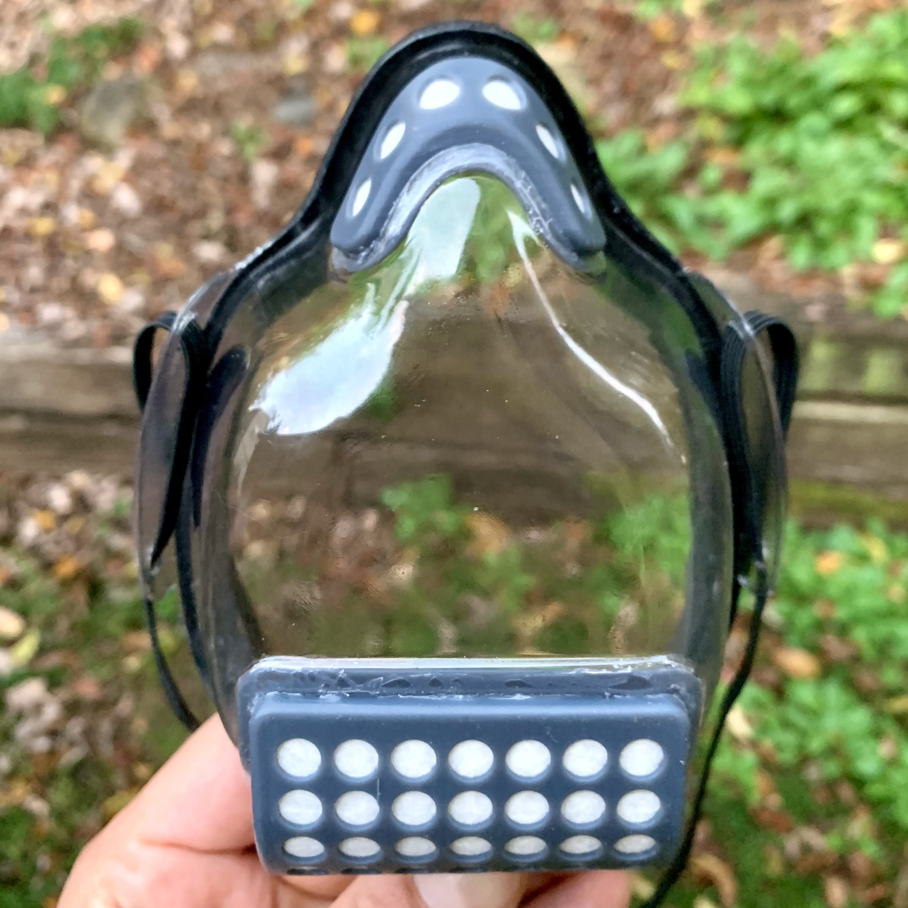
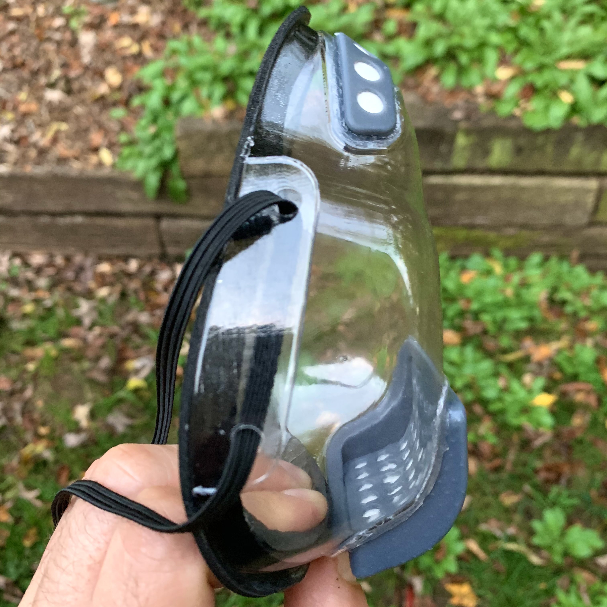
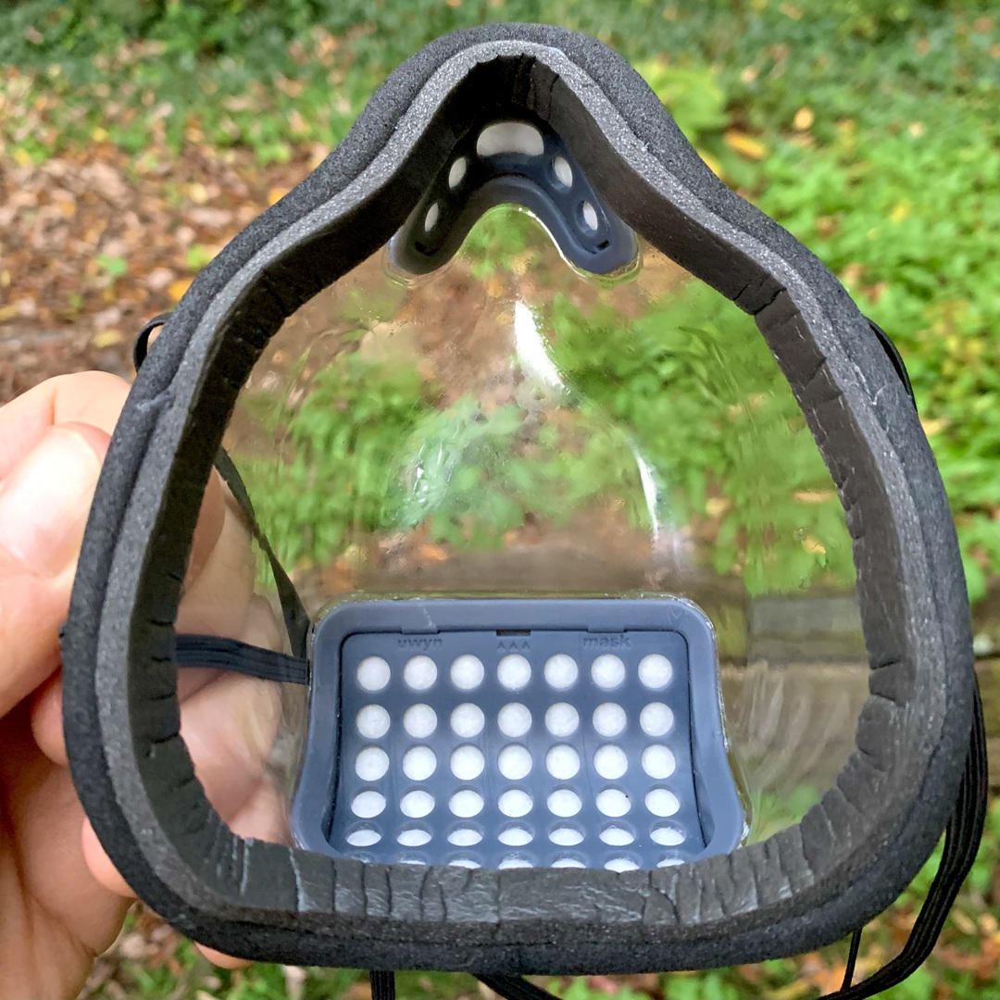

# Transparent Reusable Face Mask

Vacuum formed and 3D printed transparent face mask with replaceable filters and an excellent seal.

I've made and donated over 1000 opaque 3D printed masks that have been fit-tested and and particle tested with great results. Using the same shape and fundamental design, I spent 4 months designing a transparent mask that fits better, has more airflow and better filtration.

  

Created by Geert Bevin <gbevin@uwyn.com>
This work is freely distributed under the CC BY-SA 4.0 License.

If you want to support my efforts, please consider donating through:
http://paypal.me/geertbevin

## Features

* works with FaceID, might require setup of alternate appearance
* excellent smile and lip-reading visibility
* great airflow through natural vertical convection (top and bottom openings)
* replaceable filters that can be cut from any flat filter material (shape templates included)
* treated with temporary anti-fog spray, two anti-fog wipes are included
* edge is lined with soft weather-sealing foam to create an excellent seal
* flexible but rigid mask shell allows for comfortable facial muscle movements, you can smile and grimace again!

## Sizing

For masks sizing: measure down from the bridge of the nose to the bottom of the chin. Don't follow the curve, make sure to measure in a straight line, see photo.

This is how the sizes relate to the measured length:
* XL : length >= 5"
* L : length 4.5"-5"
* M : length < 4.5"

## Filters

It's recommended to daily replace the filters when in constant use.
For occasional use, weekly replacement is acceptable.

Recommended filter materials are:
* Filti : https://filti.com/product/filti-face-mask-material/
* BioDefensor: https://biodefensor.com

## Anti-fog

Anti-fog spray should be applied by using a microfibre cloth, spraying the cloth in order to not wet the mask's filters, then gently pat (not wipe) the inside of the mask with the humidified part of the cloth. Let dry overnight.

Recommended anti-fog products:
* Rain-X : https://www.rainx.com/product/glass-water-repellents-cleaners/rainx-anti-fog

Outside use of the mask in cold temperatures will cause condensation and reduced transparency.

## Disclaimer

*NO GUARANTEES:* This mask is not approved as N95 replacements and is not guaranteed to help against COVID-19 or any other disease. I have however done extensive research and the model I provide is the best I can create with my available tools and supplies.
